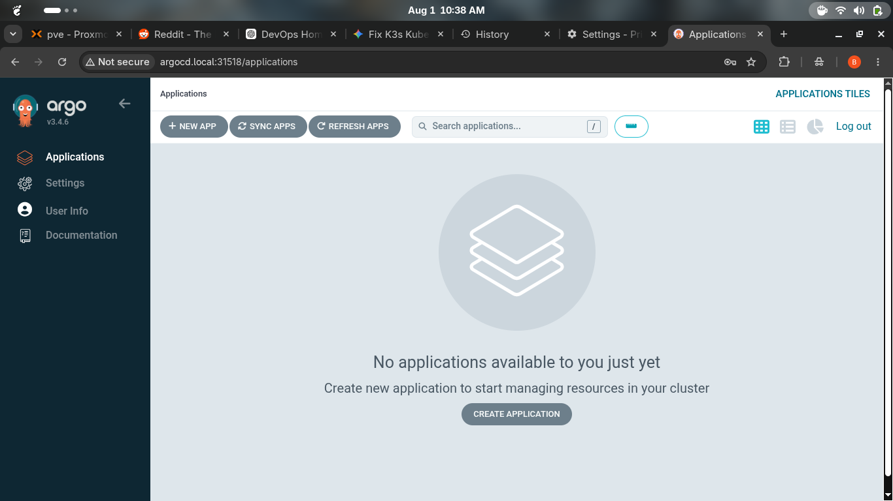
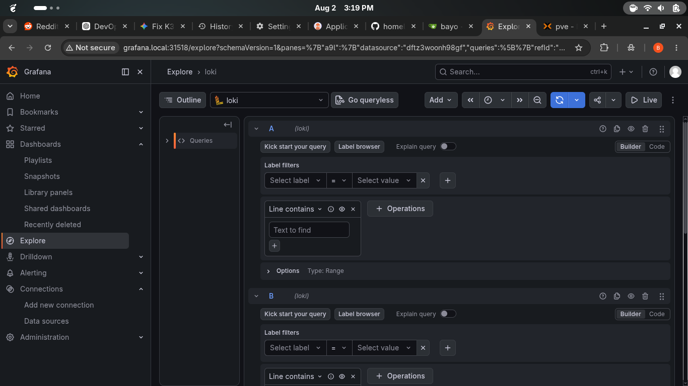

# DevOps Homelab Journey

Welcome to my homelab documentation repository. This project tracks my daily progress in building a Kubernetes-based GitOps environment from the ground up using Proxmox, K3s, and ArgoCD.

## Visual Highlights

### GitOps Delivery with ArgoCD

### Centralized Logging (Grafana, Loki, & Alloy)

---

## Daily Project Logs

Review the step-by-step build process:

* [Day 1: Initial Setup & Networking](docs/day-01.md)
* [Day 2: OS Provisioning](docs/day-02.md)
* [Day 3: K3s Cluster Bootstrapping](docs/day-03.md)
* [Day 4: Storage & Infrastructure](docs/day-04.md)
* [Day 5: GitOps Implementation](docs/day-05.md)
* [Day 6: Observability Stack](docs/day-06.md)
* [Day 7: Workload Deployments](docs/day-07.md)
* [Day 8: Refinement](docs/day-08.md)

## Troubleshooting
* [Issue Tracker & Resolutions](docs/troubleshooting.md)
