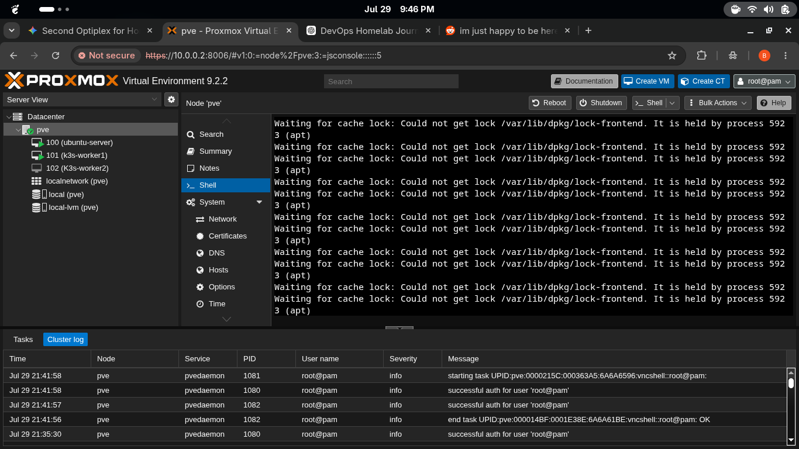
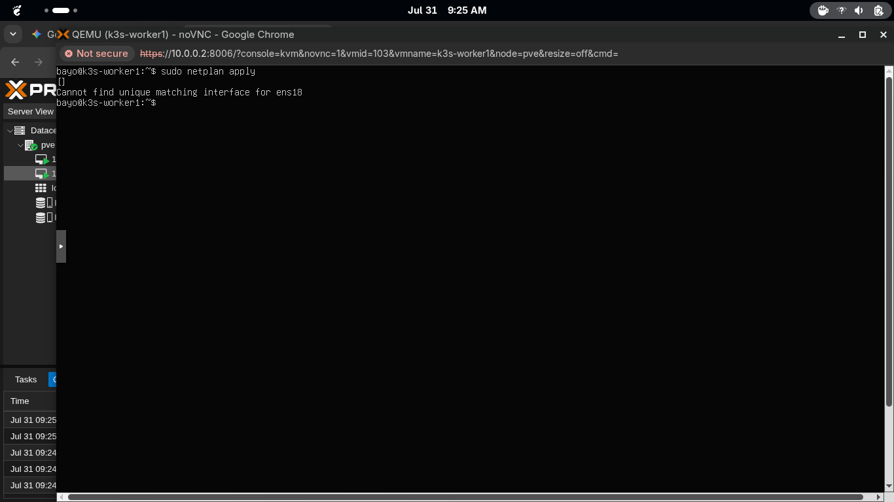
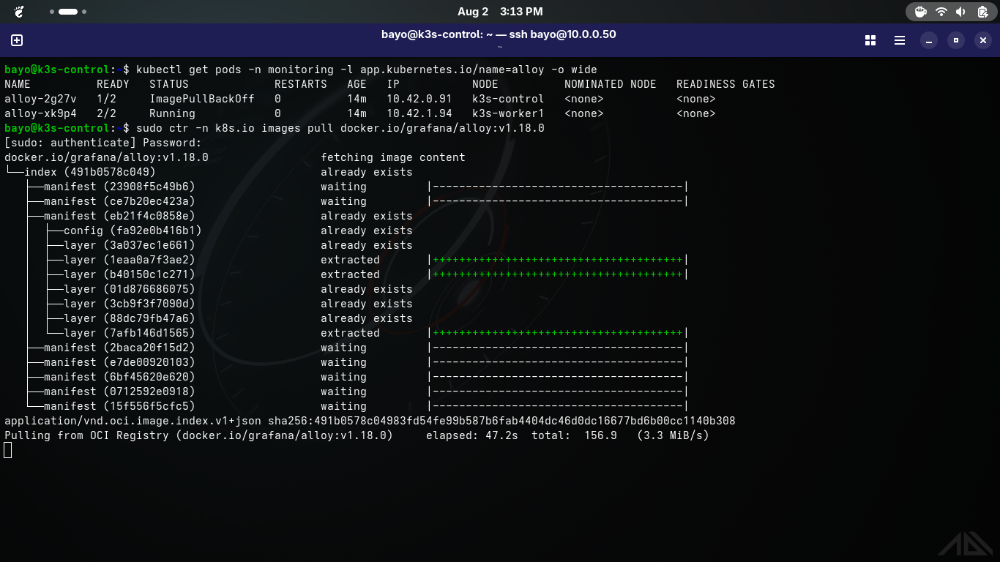
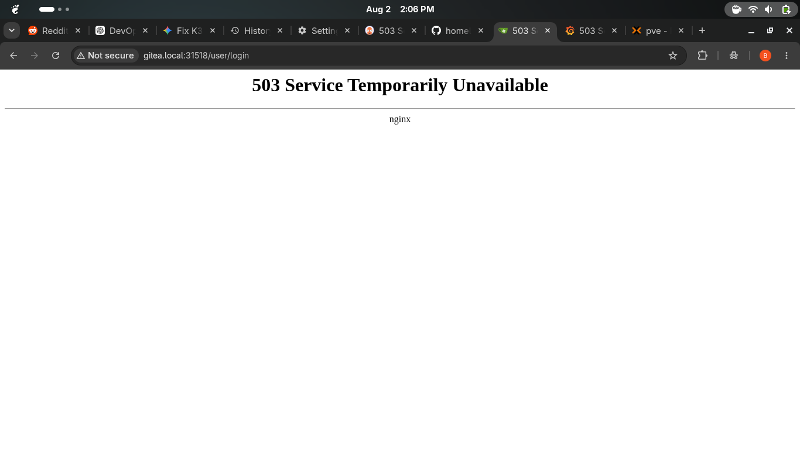

# Homelab Troubleshooting Tracker

This document logs the critical errors encountered during the homelab build and the steps taken to resolve them.

### 1. Dpkg Lock Error on Proxmox
**Symptom:** Unable to install packages due to a lock file on `/var/lib/dpkg/lock-frontend`.

**Resolution:** Identified that the `unattended-upgrades` process was running in the background. Waited for the process to release the lock naturally to avoid corrupting the package manager.

### 2. Netplan Apply Interface Error (Worker 1)
**Symptom:** Applying the netplan configuration threw an error regarding the interface definition.

**Resolution:** Verified the YAML configuration using `cat` and corrected the syntax to match the exact hardware interface (`ens18`). 

### 3. Alloy Pod ImagePullBackOff (K3s Control Plane)
**Symptom:** The Grafana Alloy pod failed to pull its image from the registry, preventing the daemonset from starting.

**Resolution:** Bypassed the temporary network timeout by manually pulling the Docker image directly into the containerd namespace using:
`sudo ctr -n k8s.io images pull docker.io/grafana/alloy:v1.18.0`

### 4. Gitea Ingress 503 Service Unavailable
**Symptom:** The Nginx Ingress Controller returned a 503 error when attempting to access the Gitea web interface.

**Resolution:** Investigated the backend service endpoints to ensure the Gitea pods were fully initialized and passing readiness probes before the ingress controller routed traffic.
